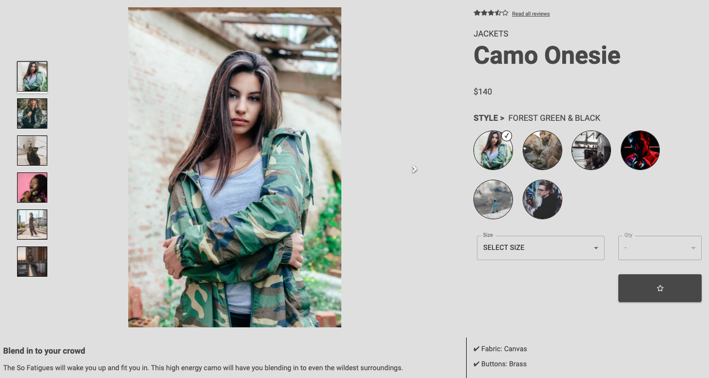
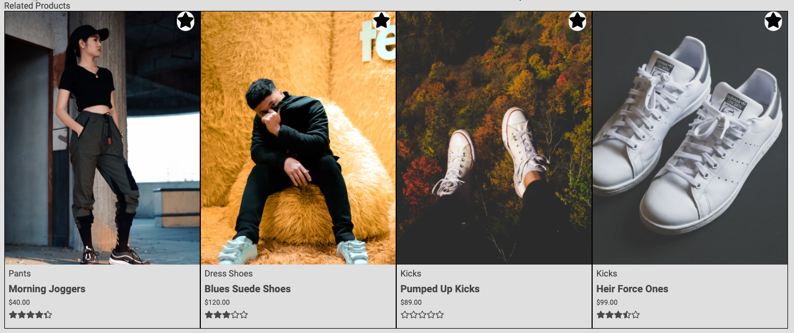
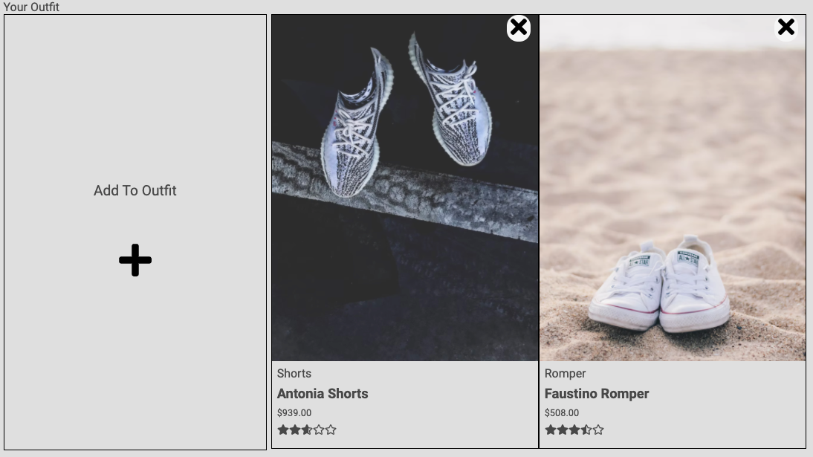
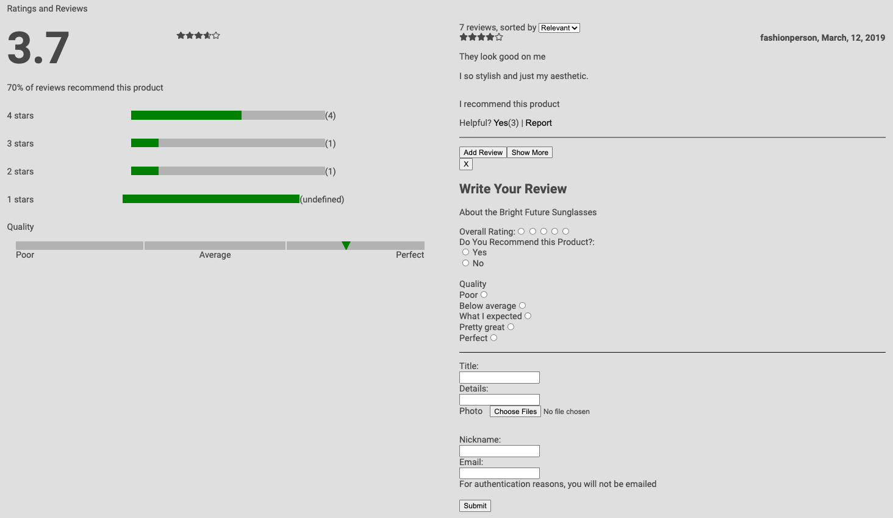

# FEC: Project Atelier

Project Atelier is a front-end user interface for a fictional e-commerce client - developed as part of the HackReactor senior curriculum.

## Components
Project Atelier contains 3 main interface components - an Overview, Related Products/Outfit, and Ratings/Reviews.  Product information is pulled from HackReactor's API.

### Overview Component
The Overview component contains basic information about the current product - the name, description, average rating, available styles, available sizes/qty's, and a gallery containing the pictures for each style.

Upon expanding the main photo, a full-screen modal will open which allows the user to zoom in (2.5x) and pan around the image.

Available sizes and qty's are rendered based on availability.  If any product or style has no available sizes, the Size and Qty boxes will be inactivated and an "OUT OF STOCK" message will be displayed.



### Related Products & Outfit Component
The Related Products component dynamically renders a list of products that are similar to the currently-viewed product (as determined by the HackReactor API).  If the list contains more related products than will fit on the screen, arrows will appear allowing the user to scroll right & left through the options.  Clicking on a related product's image will cause the browser to navigate to that product's page.

The Outfit component allows users to save the current product to an Outfit (similar to a shopping list).  Each user's outfit list is saved in their local system storage so that it is unique to them, and can persist across browser sessions.  Clicking on the 'X' icon in the corner of a product card will remove the product from the user's outfit list.




### Ratings & Reviews Component
The Ratings & Reviews Component is broken into 3 main sections - a summary, a reviews list, and a new review form.

The Ratings & Review summary displays the current product's average star rating, % of users who would recommend the product, and a breakdown of ratings  for various characteristics of the product (i.e. fit, quality, etc.).

The Reviews list displays all of the reviews for the current product (feedback, user photos, individual star rating etc.).  Reviews will be loaded 2 at a time after each click on the "Show More" button.

The New Review form will prompt the user to enter feedback, assign a star rating, and answer various questions related to the current product.  Users will also also have the ability to upload photos as part of their review submission.



## Installation

- Fork and clone the repository to your local machine.
- Navigate to the newly-created repo folder: `/FEC`
- Use the package manager [npm](https://www.npmjs.com/) to install the required dependencies.

```bash
npm install
```
- Create a file named `.env` in the repo's root directory.  This file should contain your Github API Token and Preferred Default Product ID in a format that matches the file named `.env.example`

## Development Environment
- To run the development environment, execute the following scripts as needed in separate terminal windows:
```bash
# To run the server
npm run back

# To run the front-end compiler
npm run front

# To run the automated test suite
npm run test
```

## Accessing the App
With the server running and front-end compilation complete, the application can be accessed via the browser at ``http://localhost:3000/{product-id-here}``

## Misc. Information
### Team Members
- [Ernesto Ortega-Hernandez](https://github.com/ErnestoOrtegaHernandez)
- [Josh Kohl](https://github.com/JK0hl)
- [Drew Payton](https://github.com/djp0301)

### Technologies Used
- JavaScript ES6
- Express
- NodeJS
- ReactJS
- HTML5
- CSS3
- jQuery
- Axios
- Babel
- Webpack
- MUI
- FontAwesome
- Jest / React Testing Library